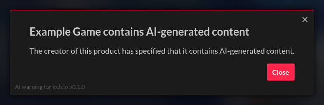

# AI warning for itch.io

Shows a warning popup on itch.io pages of products containing AI generated content.

When visiting the itch.io page of a product tagged with AI-generated content tags, this extension will display a warning as a modal popup. Additionally, it will blur out the rest of the page until the popup is dismissed.

## Installation

**AI warning for itch.io** can be installed as a native browser extension for Firefox or Chrome, or as a userscript for any supported browser. All variants run the exact same code, so installation and updates are the only differences.

### Option 1: Install as a browser extension for Firefox or Chrome _(soon™)_

The extension has been submitted to both Mozilla and Google for review. The links to both versions will be added here, as soon as they're approved. This shouldn't take longer than 2-3 days.

### Option 2: Install as a userscript

This option is slightly less straight-forward, if you've never used a userscript, but you get updates as soon as they're available.
1. If necessary, install a userscript manager for your browser, for example by following the instructions at [Greasy Fork](https://greasyfork.org/#home-step-1).
2. [Click here to install the userscript](https://github.com/seeeeew/aiwarningforitchio/raw/refs/heads/main/aiwarningforitchio.user.js) _or_ download [`aiwarningforitchio.user.js`](https://github.com/seeeeew/aiwarningforitchio/blob/main/aiwarningforitchio.user.js) to install it manually.

## Platform and Language Support

The native browser extension should work in any up-to-date version of Firefox, Chrome, or any related browsers that can install extensions from the same sources, on any desktop OS. The Firefox version also works on mobile systems.

The userscript should work in any up-to-date browser with userscript support on any desktop or mobile OS.

This extension and its download/installation pages as well as metadata like the extension description are only available in English.

## Project Scope

This extension's sole purpose is making sure that when a user are views a product on itch.io that includes AI-generated content, they're aware of that fact. Future updates might improve this functionality, but will not add unrelated features.
